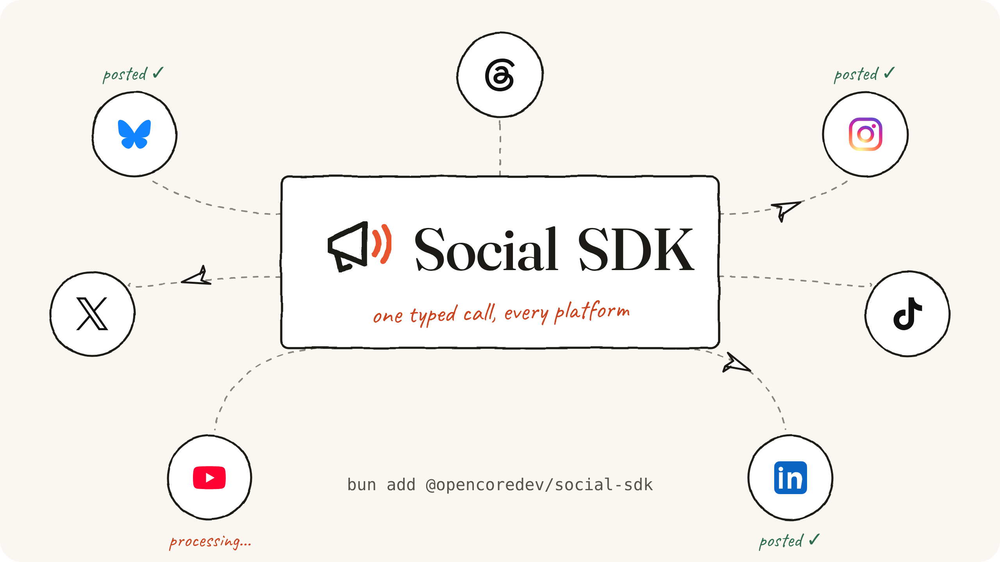

<p align="center">
  <a href="https://social-sdk.dev"></a>
</p>

<p align="center">
  <a href="https://github.com/opencoredev/social-sdk/stargazers"></a>
  <a href="https://x.com/leodev"></a>
</p>

Typed social platform integrations for TypeScript applications. Use direct platform adapters or an optional managed backend while keeping account selection, capabilities, content, and delivery outcomes explicit.

- Direct adapters for Bluesky, Instagram, LinkedIn, Threads, TikTok, X, and YouTube
- Optional managed backends for Zernio and Post for Me
- Typed capability manifests and platform-native operations behind explicit subpath imports
- Independent per-destination outcomes for complete, processing, uncertain, and failed work
- A deterministic mock backend for local development and contract tests
- An offline CLI for adapter discovery, capability checks, diagnostics, and request validation

## Install

Social SDK runs in trusted server-side code on Node.js 22.12+ or Bun. Keep platform tokens, managed-provider keys, OAuth secrets, and webhook secrets out of browser bundles.

```bash
npm install @opencoredev/social-sdk
# or
bun add @opencoredev/social-sdk
```

For application setup and integration options, see the [installation guide](https://social-sdk.dev/docs/getting-started/installation).

## Usage

Start with the mock backend to verify an integration without credentials, platform calls, or billable provider requests:

```ts
import { createSocial, connectedAccountRef } from "@opencoredev/social-sdk";
import { mockBackend } from "@opencoredev/social-sdk/testing";

const social = createSocial({
  backend: mockBackend({ scenario: "immediate-text-success" }),
});

const result = await social.posts.publish({
  targets: [
    {
      account: connectedAccountRef({
        backend: "default",
        platform: "x",
        accountId: "mock-account-1",
      }),
    },
  ],
  content: { text: "Hello from Social SDK" },
  idempotencyKey: "quickstart-1",
});

console.log(result.status, result.outcomes[0]?.state);
// complete published
```

The same client shape works with a direct platform adapter or a managed backend. Import only the adapter you use from its documented subpath.

## Platforms and backends

Direct platform adapters cover Bluesky, Instagram, LinkedIn, Threads, TikTok, X, and YouTube. Hosted execution routes are available through the [Zernio](https://social-sdk.dev/docs/backends/zernio) and [Post for Me](https://social-sdk.dev/docs/backends/post-for-me) adapters. Managed services are optional; a direct integration does not require a Social SDK account.

Read the [platform capability matrix](https://social-sdk.dev/docs/reference/capabilities) before choosing an adapter. It describes the normalized operations implemented by each integration and does not replace provider permissions, account eligibility, or live verification.

## CLI

The `social-sdk` CLI is offline. It does not authenticate accounts, upload media, publish content, or make hidden network requests.

```bash
social-sdk adapters --json
social-sdk capabilities --adapter youtube --json
social-sdk doctor --adapter zernio --json
social-sdk examples --json
social-sdk validate --adapter mock --file request.json --json
```

See the [CLI reference](https://social-sdk.dev/docs/reference/cli) for command output, validation limits, and exit codes.

## Documentation

Full documentation lives at **[social-sdk.dev/docs](https://social-sdk.dev/docs)**. Good places to start:

- [Installation](https://social-sdk.dev/docs/getting-started/installation)
- [Mock quickstart](https://social-sdk.dev/docs/getting-started/mock-quickstart)
- [Choose an integration](https://social-sdk.dev/docs/getting-started/choose-an-integration)
- [Publish content](https://social-sdk.dev/docs/publishing)
- [Handle outcomes and reconciliation](https://social-sdk.dev/docs/concepts/references-and-outcomes)

## Sponsors

Social SDK is supported by companies that help keep platform integrations practical and maintained. Want your logo here? **[Become a sponsor →](https://github.com/sponsors/opencoredev)**

<p align="center">
  <a href="https://github.com/sponsors/opencoredev">
    <picture>
      <source media="(prefers-color-scheme: dark)" srcset="https://shieldcn.dev/sponsors/opencoredev.svg?title=false&mode=dark&preset=surface" />
      <source media="(prefers-color-scheme: light)" srcset="https://shieldcn.dev/sponsors/opencoredev.svg?title=false&mode=light&preset=surface" />
      
    </picture>
  </a>
</p>

<p align="center"><sub><a href="./LICENSE">MIT License</a> · Built by <a href="https://x.com/leodev">@leodev</a></sub></p>
