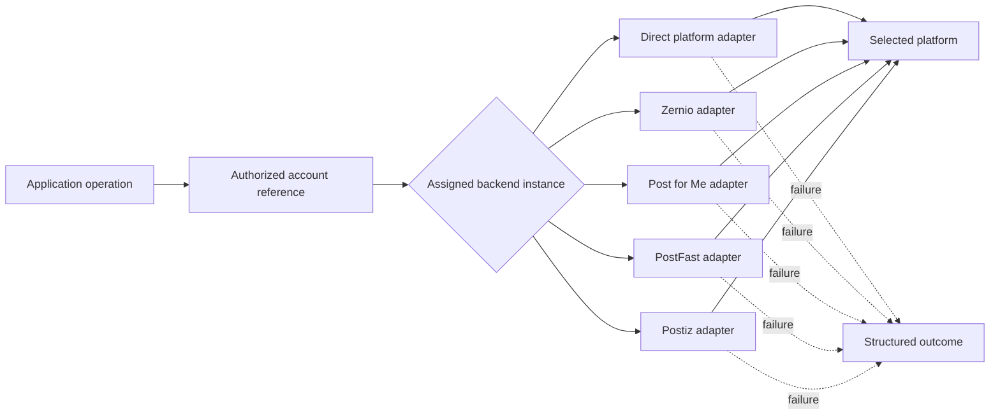
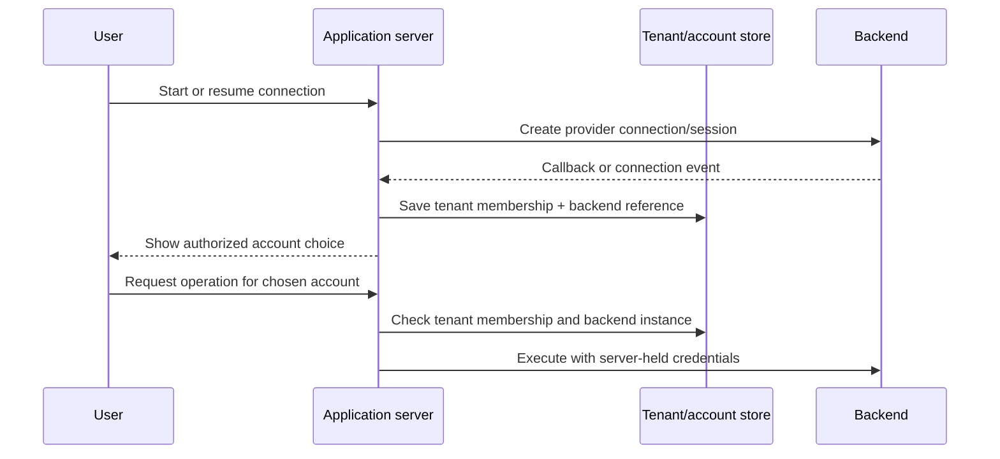
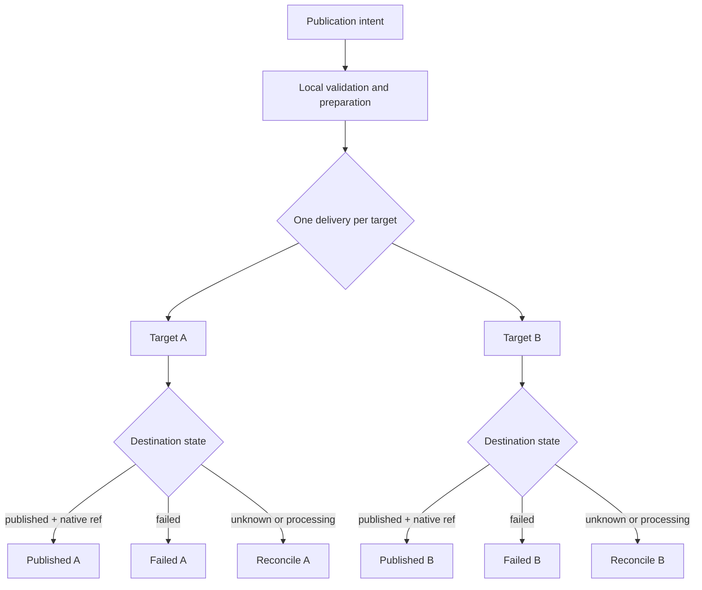
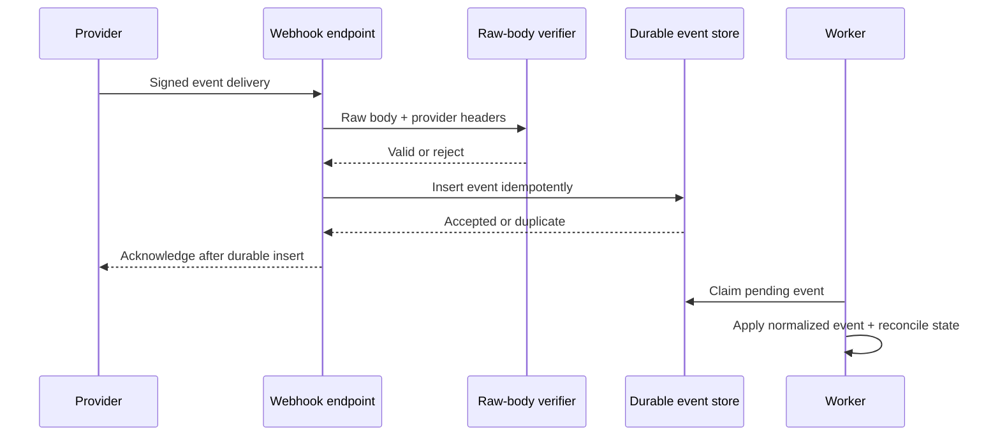

These diagrams show the boundaries an application must keep explicit. The diagrams describe the contract; an adapter's capability manifest and evidence determine which operations are available for a particular backend and platform.

## Backend routing

An account reference selects one configured backend instance before dispatch. A failure does not authorize a different destination or backend.

## Account connection and ownership

The application owns tenant membership. The backend owns its connection and token lifecycle. A browser request cannot turn a display identifier into an authorized backend call.

## Per-target publication lifecycle

One publication intent can fan out to several targets, but every delivery has its own lifecycle. `accepted` and `processing` remain pending.

## Durable webhook acceptance

Verify the backend's actual signature or shared-secret mechanism on the raw body before parsing. Persist a deduplication key before acknowledging so retries are safe.

