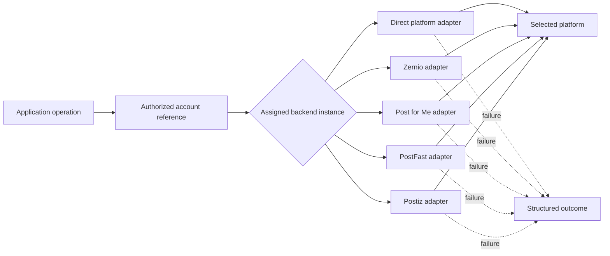
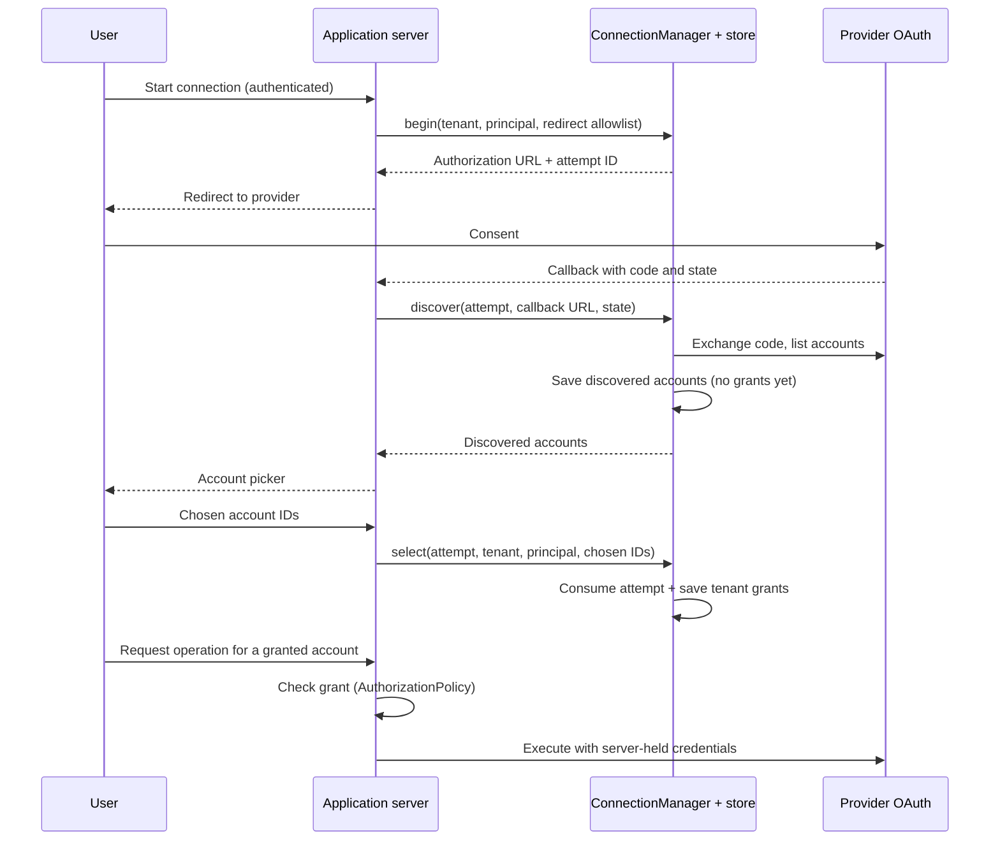
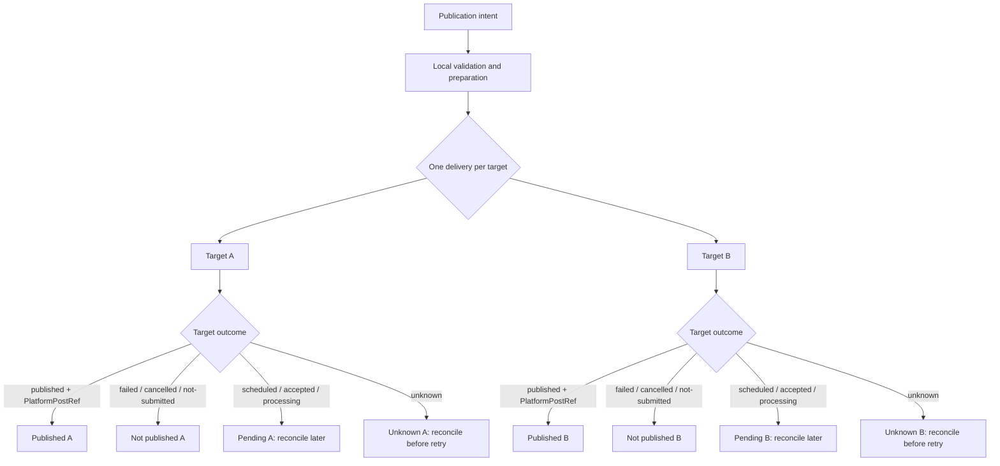
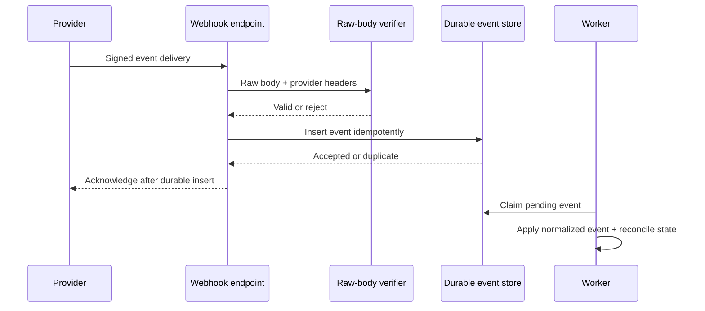

These diagrams show the boundaries an application must keep explicit. The diagrams describe the contract; an adapter's capability manifest and evidence determine which operations are available for a particular backend and platform.

## Backend routing

An account reference selects one configured backend instance before dispatch. A failure does not authorize a different destination or backend.

```mermaid
flowchart LR
  Request[Application operation] --> Account[Authorized account reference]
  Account --> Route{Assigned backend instance}
  Route --> Direct[Direct platform adapter]
  Route --> Zernio[Zernio adapter]
  Route --> PostForMe[Post for Me adapter]
  Route --> PostFast[PostFast adapter]
  Route --> Postiz[Postiz adapter]
  Direct --> Platform[Selected platform]
  Zernio --> Platform
  PostForMe --> Platform
  PostFast --> Platform
  Postiz --> Platform
  Direct -. failure .-> Error[Structured outcome]
  Zernio -. failure .-> Error
  PostForMe -. failure .-> Error
  PostFast -. failure .-> Error
  Postiz -. failure .-> Error
```

## Account connection and ownership

The application owns tenant membership. The backend owns its connection and token lifecycle. Discovered accounts are only candidates: a tenant grant exists only after the user picks accounts and `select` stores them. A browser request cannot turn a display identifier into an authorized backend call.

```mermaid
sequenceDiagram
  participant User
  participant App as Application server
  participant Manager as ConnectionManager + store
  participant Provider as Provider OAuth
  User->>App: Start connection (authenticated)
  App->>Manager: begin(tenant, principal, redirect allowlist)
  Manager-->>App: Authorization URL + attempt ID
  App-->>User: Redirect to provider
  User->>Provider: Consent
  Provider-->>App: Callback with code and state
  App->>Manager: discover(attempt, callback URL, state)
  Manager->>Provider: Exchange code, list accounts
  Manager->>Manager: Save discovered accounts (no grants yet)
  Manager-->>App: Discovered accounts
  App-->>User: Account picker
  User->>App: Chosen account IDs
  App->>Manager: select(attempt, tenant, principal, chosen IDs)
  Manager->>Manager: Consume attempt + save tenant grants
  User->>App: Request operation for a granted account
  App->>App: Check grant (AuthorizationPolicy)
  App->>Provider: Execute with server-held credentials
```

## Per-target publication lifecycle

One publication intent can fan out to several targets, but every delivery has its own outcome. `scheduled`, `accepted`, and `processing` are pending and need later reconciliation. `published` always carries a `PlatformPostRef` in `post`; the provider-native identifiers inside it are optional.

```mermaid
flowchart TD
  Intent[Publication intent] --> Prepare[Local validation and preparation]
  Prepare --> Fanout{One delivery per target}
  Fanout --> A[Target A]
  Fanout --> B[Target B]
  A --> AState{Target outcome}
  B --> BState{Target outcome}
  AState -->|published + PlatformPostRef| DoneA[Published A]
  AState -->|failed / cancelled / not-submitted| StopA[Not published A]
  AState -->|scheduled / accepted / processing| PendingA[Pending A: reconcile later]
  AState -->|unknown| ReconcileA[Unknown A: reconcile before retry]
  BState -->|published + PlatformPostRef| DoneB[Published B]
  BState -->|failed / cancelled / not-submitted| StopB[Not published B]
  BState -->|scheduled / accepted / processing| PendingB[Pending B: reconcile later]
  BState -->|unknown| ReconcileB[Unknown B: reconcile before retry]
```

The publication `status` summarizes the targets. It is `complete` when every target published, `pending` when every target is pending, and `partial` for any other mix, including published plus processing. Read each target's `state` rather than the summary.

## Durable webhook acceptance

Verify the backend's actual signature or shared-secret mechanism on the raw body before parsing. Persist a deduplication key before acknowledging so retries are safe.

```mermaid
sequenceDiagram
  participant Provider
  participant Endpoint as Webhook endpoint
  participant Verify as Raw-body verifier
  participant Events as Durable event store
  participant Worker
  Provider->>Endpoint: Signed event delivery
  Endpoint->>Verify: Raw body + provider headers
  Verify-->>Endpoint: Valid or reject
  Endpoint->>Events: Insert event idempotently
  Events-->>Endpoint: Accepted or duplicate
  Endpoint-->>Provider: Acknowledge after durable insert
  Worker->>Events: Claim pending event
  Worker->>Worker: Apply normalized event + reconcile state
```
